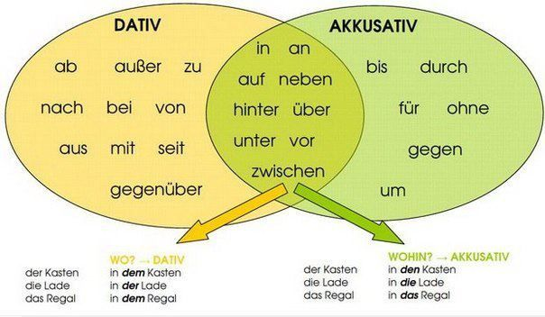

## Wechselpräpositionen / Prepositions of change / Değişken Edatlar

 Alternate prepositions are sometimes require the dative and sometimes the accusative.

 - The case of the declined word after one of these prerpositions can change (akkustiv or dativ)
 - The verb in the sentece determines the case of the declined word after the position.
 - Verb which implies a MOVEMENT -> **accusative**
 - Verb which implies a CONDITION -> **dativ**
 - Question for the adverbial phrase: **Wohin?** (Where to) -> **accusative**
 - Question for the adverbial phrase: **Wo?** (Where) -> **dativ**

Präposition | Akkusativ (MOVEMENT) _Hareket_ | Dativ (CONDITION) _Bulunma_ | Warum Why? _Neden_
--- | --- | --- | ---
**in** in _içinde_ / _iç_ | **Ich gehe in den Garten** I go into the garden _Bahçeye gidiyorum_ | **Ich bin im (in dem) Garten** I am in the garden _Bahçedeyim_ | gehen (to go) involves movement
**hinter** behind _arkasında_ | **Ich setlle mich hinter die Tür** I get behind the door _Kapının arkasına geçiyorum_ | **Ich stehe hinter der Tür** I am standing behind the door _Kapının arkasında duruyorum_ | die Tür (Nom. and Aku.) der Tür (dative) stelle is reflexive verb (go and stand somewhere)
**auf** on top of _üzerinde_ / _üzerinden_ | **Ich klettere auf das Dach** I climb onto the roof _Çatıya tırmanıyorum_ | **Ich sitze auf dem Dach** I am sitting on the roof _Çatıda oturuyorum_ | das Dach (Nom. and Aku.)  dem Dach (dative)
**unter** under / below _altında_ | **Der Hund kriecht unter den Tisch** The dog is crawling under the table _Köpek masanın altında sürünüyor_ | **Der hund liegt unter dem Tisch** The dog is lying under the table _Köpek masanın altında yatıyor_ | der Tisch (N) den Tisch (A) dem Tisch (D)
**zwischen** between _arasında_ | **Ich stelle mich zwischen meinen Bruder und meine Schwester** I get between my brother and sister _Ben erkek kardeşim ile kız kardeşimin arasına geçiyorum_ | **Ich stehe zwischen meinem Bruder und meiner Schwester** I am standing between my brother and sister _Erkek kardeşim ile kız kardeşimin arasında duruyorum_ | mein Bruder (N) meinen Tisch (A) meinem Bruder (D) meines Bruders(G)

## Die Kontraktionen
Die Kontraktionen von Artikeln mit Wechselpräpositionen

Präposition | Artikel | Resultat
--- | --- | ---
in + | dem | = im
an + | dem | = am
auf + | das | = aufs
in + | das | = ins
an + | das | = ans