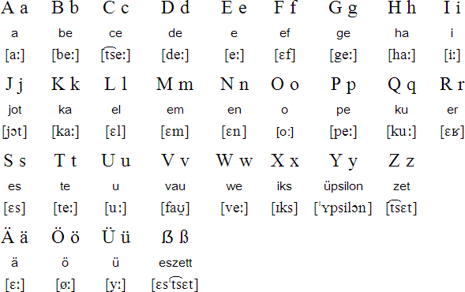

# Almanca / Deutsch
The lesson notes I have taken to learn the German language beginning from A1. I decided to create this git repository to regularly improve, remember and read them again in the future.

## das Alphabet

## Contribute
 - Are you also interested with the language? Any kind of PR's are welcome!
 - Have you found a problem and want to report it? Please **[create a new issue](https://github.com/edigu/almanca/issues/new)** and describe the problem in German, English or Turkish.
